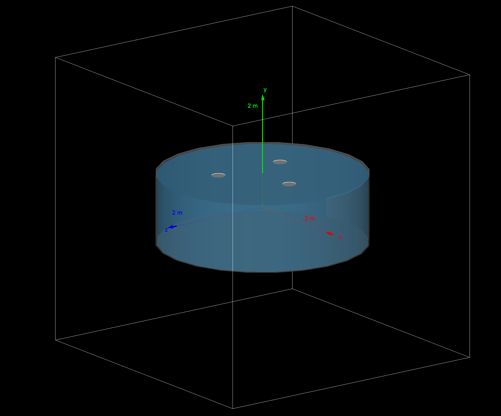

# Surface Cherenkov detector simulation using Geant4.

This project simulates a Cherenkov detector inspired by the hybrid surface detectors of the Pierre Auger Observatory. These detectors use water tanks equipped with photomultiplier tubes (PMTs) to detect Cherenkov light produced by charged particles crossing the water.

Here, we present a simplified implementation of such a setup to measure the number of optical photons generated by the impact of a cosmic ray.

## Requirements.

To compile and run this simulation, make sure you have [Geant4](https://geant4.web.cern.ch/) properly installed and configured in your system.


## Building the Project.

Clone the repository and run the following commands from the root directory:

``` shell
mkdir build
cd build
cmake ..
make 
```

This will compile the simulation and generate the sim executable.

## Running the simulation.

After building the executable, run it as follows:
``` shell
./sim
```

## Detector description.

The detector consists of a cylindrical plastic tank filled with 12,000 liters of ultrapure water. Three PMTs, each 23 cm in diameter, are positioned at the surface of the water in an equilateral triangular arrangement. Cherenkov photons are detected by these PMTs.
<p align="center">
  
</p>

Optical properties for the different materials are defined to simulate realistic light propagation and detection conditions.

For a detailed description there is a report in ```/doc/report.pdf```.